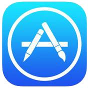
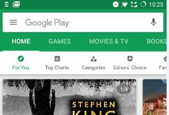
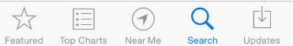
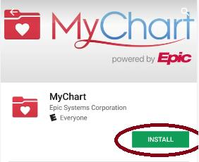
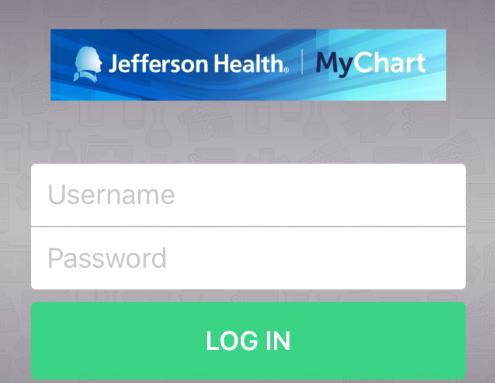
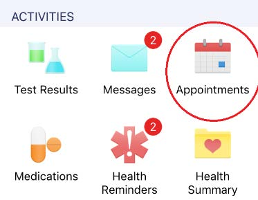
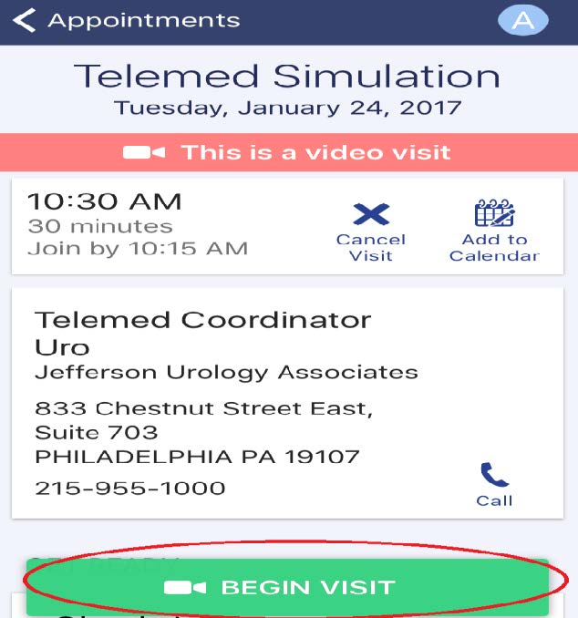

# Initiating Video Visit on MyChart App

## Step 1: Open GooglePlay or Apple App Store
Find the mobile app store on your phone, you can go into the app menu and search for it. Depending whether you are on an Apple device or an Android, the icons below are the locations to search for the app.

 

## Step 2: Search for the App

**Android:** Open the play store go to the search bar at the top that says “GooglePlay”, search for “MyChart EPIC”

**Apple:** Click “search” which appears as a magnifying glass, in the bottom right. Search for “MyChart EPIC”.

**Step 3:** Chose the logo of a red folder with a white heart. Click “Get” (Apple) or “Install” (Android). Once it’s done , the “install” it will now say open, click it.

**Step 4:** When you open the app, make sure to locate yourself to Pennsylvania. The list of providers will include “Jefferson Health”. Tap twice to confirm.

**Step 5:** After logging in, find your visit in the appointments section.

**Step 6:** Click Begin Visit

**Step 7:** Hold tight while the Provider connects. If the app shuts down ; please check your internet connection and reopen your MyChart app to reconnect.
